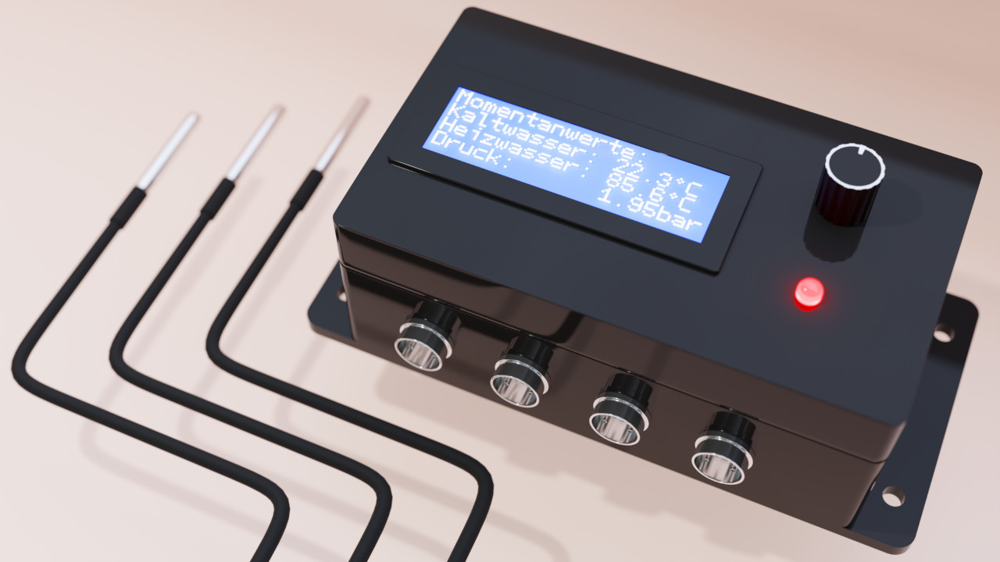

# PoolControl

Dieses Projekt dient zur Überwachung einer Solaranlage, die zur Beheizung eines Pools dient.
Die gemessenen Daten können lokal über ein LCD und sowie per Handy oder Web-App mithilfe des Services [**Arduino Cloud**](https://cloud.arduino.cc) abgerufen werden.

# Verfügbare Sensoren:
- Drucksensor (Wasserdruck)
- Temperatursensor Kaltwasser
- Temperatursensor Heizwasser
- Temperatursensor Poolwasser

# Interaktion mit dem System:
- Lokal: über LCD und Rotary-Encoder
- Remote: über ArduinoIoTCloud Dashboard

# Product-Render (made with blender)

# Implementierte Funktionen:
- [X] Implementierung der Sensoren für Kalt- und Warmwasser
- [X] Arduino Cloud Kommunikation
- [X] LCD Visualisierung
- [X] Anbindung des Poolsensors
- [X] Statusanzeige lokal über LED
- [X] Statusanzeige remote über Chat-Fenster
- [X] Rotary Encoder für Interaktionen
- [X] Interaktion lokal/remote für System-Reset 
- [ ] Ansteuern der Umwälzpumpe mithilfe von SSR Relais

# Zukunft des Projekts
Für dieses Projekt werden unter diesem Repository vorrausichtlich nur noch Bugfixes veröffentlicht.
Für das verbesserte Menü sowie ein lokal gehosteter Webserver wird ein eigenes Repository angelegt.
Zudem soll der Code universeller gehalten werden um die Erweiterbarkeit des Systems zu verbessern.
